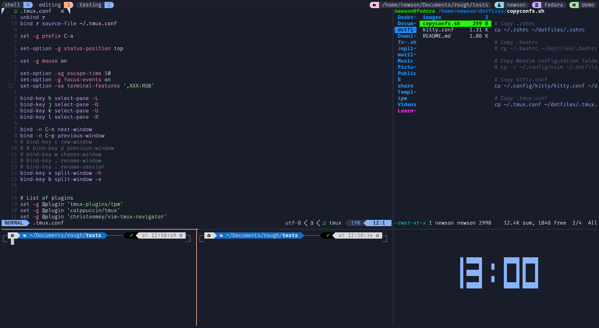

### Nothing much.

## neovim config have a separate repo. Check it out

### Enjoy

## Tmux:

- Tmux is a terminal multiplexer. In my own words. tmux is something that takes care of my terminal windows and projects. No matter I change the computer, reboot. My opened projects will stay in the same way so I can work on them on any computer that have tmux. We don't need to navigate everytime you open the project repository, with tmux, I can continue my project from where I left from anywhere, any computer with ssh session and tmux session, It even remembers where my cursor was, So, I can flashback and start the flow that was paused. it supports real time update and collaboration with team by sharing sessions. And we have tmuxifier, that let us create template or own version of session. that starts with a single command at specific repository. Tmux is the best friend of neovim(checkout on another repository), They can work together with unity. For me, Tmux + vim = Most powerful IDE. Check it out

## What tmux looks like!

## Kitty:

- Kitty is just a terminal, that supports windows and tabs, just like tmux windows and panes but It's fast for quick things and working with multiple files and is highly customizable and fast, which makes it better option for using it with tmux,neovim.etc...

## What kitty looks like!

## Zsh:

- My zsh contains theme, plugins like autocomplete, syntax highlighting, git integration etc. Fuzzyfinder (fzf) is also integrated along with bat preview and git integration on bat let us see live changes and diff of git files side by side. It contains custom aliases and also contains pomodoro that announces the session. I use autojump, which remembers the folders far far away and let me jump to the folder with j word. and much more.....

## extension settings, wm keybindings, lazygit and more added

#### Note: If you think, they look good. They work good \* 3000 . Feel free to use.
